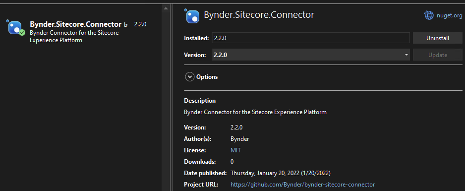
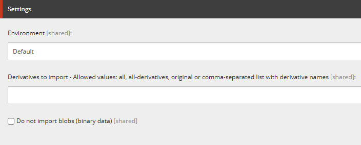
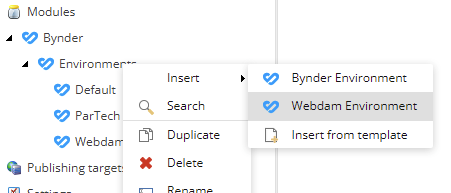
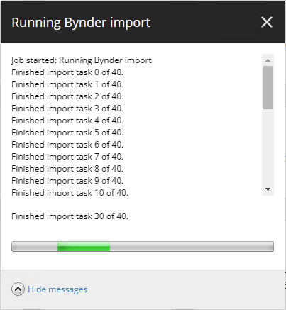
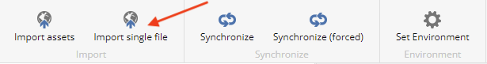
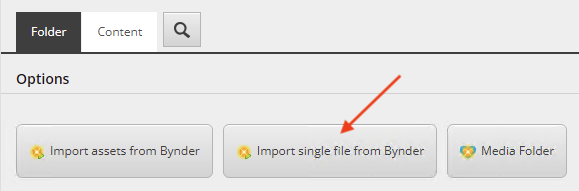
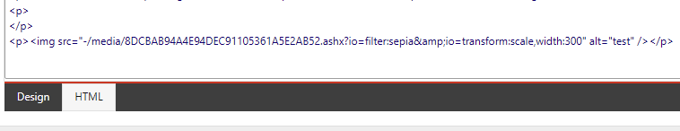
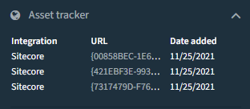

# Bynder Sitecore Connector documentation

_Updated for 2.3.1_

<hr />

**IMPORTANT:**  
**This variant of the Bynder Sitecore integration is deprecated and no longer recommended for new customers!**  
**It has been replaced by the [Bynder DAM Connector for Sitecore XP/XM](https://bynder.humandigital.services/).**  
**This repository only exists as a reference for existing customers and only existing customers will continue to receive support for this connector.**

If you are not already using the Bynder Sitecore Connector, then please visit the [dedicated portal](https://bynder.humandigital.services/) for the **[Bynder DAM Connector for Sitecore XP/XM](https://bynder.humandigital.services/)**.

<hr />

The Bynder Sitecore Connector provides you with two methods of connecting your Sitecore platform to **[Bynder Digital Asset Management](https://www.bynder.com/en/products/digital-asset-management/)** and to **[Webdam](https://www.bynder.com/en/webdam/)**.  
By leveraging the [Bynder Field Types](#4-using-the-bynder-field-types) you are able to store references to Bynder assets that allow you to embed the assets on your website, always reflecting the latest version of the asset in Bynder.  
With the [Bynder Asset Import](#5-using-the-bynder-asset-import) you get to import assets from Bynder or Webdam into the Sitecore Media Library. This allows you to apply the assets to the full range of Sitecore's features.

This documentation guides you through all aspects of the installation and usage of the Bynder Sitecore Connector.

## Table of contents

- **[1) Installation](#1-installation)**
  - [1.1) Supported Sitecore versions](#11-supported-sitecore-versions)
  - [1.2) Installation package](#12-installation-package)
  - [1.3) NuGet package](#13-nuget-package)
  - [1.4) Required web.config changes](#14-required-webconfig-changes)
- **[2. Upgrade instructions](#2-upgrade-instructions)**
  - [2.1) Upgrading from 1.x to 2.1](#21-upgrade-from-1.x)
  - [2.2) Upgrading from 2.0 to 2.1](#22-upgrade-from-2.0)
  - [2.3) Upgrading from 2.1 to 2.2 (or 2.3)](#23-upgrade-from-2.1)
- **[3) Configuration](#3-configuration)**
  - [3.1) Configuring the Bynder Field Types](#31-configuring-the-bynder-field-types)
  - [3.2) Configuring the Bynder Asset Import](#32-configuring-the-bynder-asset-import)
- **[4) Using the Bynder Field Types](#4-using-the-bynder-field-types)**
- **[5) Using the Bynder Asset Import](#5-using-the-bynder-asset-import)**

## 1) Installation

- [1.1) Supported Sitecore versions](#11-supported-sitecore-versions)
- [1.2) Installation package](#12-installation-package)
- [1.3) NuGet package](#13-nuget-package)
- [1.4) Required web.config changes](#14-required-webconfig-changes)

**If you are upgrading from _Bynder Basic Sitecore Connector_ or _Bynder Advanced Sitecore Connector_,**   
**skip ahead to the [Upgrade instructions](#2-upgrade-instructions).**

### 1.1) Supported Sitecore versions

This module supports **Sitecore version 9.3 and higher**. Make sure to use the installation package that is suited for your version of Sitecore.

If you are using _Sitecore Experience Accelerator (SXA)_ or _Sitecore JavaScript Services (JSS)_ you will not be able to leverage the Bynder Field Types because they are targeted at Sitecore MVC renderings. You will however be able to use media items that are imported with the Bynder Asset Import.

### 1.2) Installation package

The connector is provided as a Sitecore Installation Package.  
Simply [download](https://github.com/ParTech/Bynder-Sitecore-Connector-Releases/releases) the `Bynder-Sitecore-Connector_X.X.X_Installation-Package_X.X-X.X.zip` package and install it using the [Sitecore Package Installation Wizard](https://doc.sitecore.com/en/SdnArchive/Articles/Administration/Installing%20Modules%20and%20Packages.html) in the Sitecore Client.  

**DO NOT install a Sitecore package directly on a production environment without consulting your Sitecore system administrator!**

Make sure to choose the package that is targeted at your Sitecore version.  
We currently offer only one package that is target for _Sitecore 9.3 to 10.2_.

We highly recommend you to install the package on a (local) environment for testing purposes first before rolling it out across other environments.  
Consult Bynder support if you need additional assistance or consultancy during the integration process.

### 1.3) NuGet package

The Sitecore Installation Package that we provide is quick and easy method for installing the Bynder Sitecore Connector in a demo or test environment, but can be a bit cumbersome to integrate into a Visual Studio solution.  
For that purpose we also provide a NuGet package that can easily be added to a Visual Studio project.  

The NuGet package is listed under the package ID `Bynder.Sitecore.Connector`.



After you install the NuGet package, you must publish the contents of the package to your Sitecore webroot.  
Always make sure you have a backup of your webroot and your Sitecore content databases before attempting to install any external module.

If it's the first time you publish to your Sitecore webroot, you must update your tree with the serialized items provided by our package in order to create the Bynder Sitecore Connector items in your environment by following these steps:

- **Warning:** If your `App_Data\serialization` folder already has existing data, you should (temporarily) remove that so the deserialization proces does not unintentionally update existing items.
- Login to Sitecore.
- In the Content Editor, enable the Developer ribbon.
- Select the `/sitecore` root node in the content tree.
- Choose `Update tree`.
- Your content is now up to date.

### 1.4) Required `web.config` changes

The connector requires several changes to the `web.config` of your Sitecore application in order to function correctly. You must manually apply these changes as the installation package is not capable of performing this update.

- [1.4.1) Override MediaRequestHandler](#141-override-mediarequesthandler)
- [1.4.2) Content Security Policy header configuration](#142-content-security-policy-header-configuration)

#### 1.4.1) Override MediaRequestHandler

The connector needs to override Sitecore's default media requesthandler to facilitate redirecting to Bynder CDN uri if you are not storing Blob data (i.e. if you are not storing a copy of Bynder's binary data).

***Skip ahead if you are using [Sitecore Experience Accelerator (SXA)](#override-mediarequesthandler-for-sxa).***

Locate the handler configuration in the `web.config` and update the handler for path `sitecore_media.ashx` to the type `Bynder.SitecoreConnector.Providers.BynderMediaRequestHandler, Bynder.SitecoreConnector` as demonstrated in this example:

```
<handlers>
  <add verb="*" path="sitecore_media.ashx" type="Bynder.SitecoreConnector.Providers.BynderMediaRequestHandler, Bynder.SitecoreConnector" name="Sitecore.MediaRequestHandler"/>

  <!-- ... snipped other headers for simplicity ... -->
</handlers>
```

##### Override MediaRequestHandler for SXA

If you are using Sitecore Experience Accelerator (SXA), you must configure a different media requesthandler because SXA has its own implementation for this.

Locate the handler configuration in the `web.config` and update the handler for path `sitecore_media.ashx` to the type `Bynder.SitecoreConnector.Providers.BynderSxaMediaRequestHandler, Bynder.SitecoreConnector` as demonstrated in this example:

```
<handlers>
  <add verb="*" path="sitecore_media.ashx" type="Bynder.SitecoreConnector.Providers.BynderSxaMediaRequestHandler, Bynder.SitecoreConnector" name="Sitecore.MediaRequestHandler"/>

  <!-- ... snipped other headers for simplicity ... -->
</handlers>
```

#### 1.4.2) Content Security Policy header configuration

As of version 9.3 of Sitecore, the `web.config` configures a [Content Security Policy header](https://developer.mozilla.org/en-US/docs/Web/HTTP/Headers/Content-Security-Policy) that prevents malicious client-side requests from your web application. If you are using an older version of Sitecore, this may still apply if your system administrator applied this configuration manually.  

In order for the Bynder Sitecore Connector to be able to connect to Bynder and properly display its content, you must update your Content Security Policy (CSP) configuration to allow this.

The following Content Security Policies must be configured:

```
img-src https://YOUR-BYNDER-HOST.bynder.com https://cdn2.webdamdb.com;
frame-src https://YOUR-BYNDER-HOST.bynder.com; 
script-src https://d8ejoa1fys2rk.cloudfront.net; 
style-src https://d8ejoa1fys2rk.cloudfront.net; 
font-src https://d8ejoa1fys2rk.cloudfront.net; 
connect-src https://d8ejoa1fys2rk.cloudfront.net https://YOUR-BYNDER-HOST.bynder.com;
```

When applied to the **default** Sitecore `web.config` (again, this applies to Sitecore 9.3 and higher), the configuration must look like this:

```
<location path="sitecore">
  <system.webServer>
    <httpProtocol>
      <customHeaders>

        <!-- ... snipped other headers for simplicity ... -->
        <!-- ... used line breaks for clearity, DO NOT USE LINE BREAKS in the actual config! ... -->

        <add name="Content-Security-Policy" 
             value="default-src 'self' 'unsafe-inline' 'unsafe-eval'; 
                    img-src 'self' data: https://YOUR-BYNDER-HOST.bynder.com https://cdn2.webdamdb.com; 
                    frame-src 'self' https://YOUR-BYNDER-HOST.bynder.com; 
                    script-src 'self' 'unsafe-inline' 'unsafe-eval' https://d8ejoa1fys2rk.cloudfront.net; 
                    style-src 'self' 'unsafe-inline' https://fonts.googleapis.com https://d8ejoa1fys2rk.cloudfront.net; 
                    font-src 'self' 'unsafe-inline' https://fonts.gstatic.com https://d8ejoa1fys2rk.cloudfront.net; 
                    connect-src 'self' 'unsafe-inline' 'unsafe-eval' https://d8ejoa1fys2rk.cloudfront.net https://YOUR-BYNDER-HOST.bynder.com; 
                    upgrade-insecure-requests; block-all-mixed-content;" />

        <!-- ... make sure to replace YOUR-BYNDER-HOST with your own Bynder portal hostname ... -->

    </customHeaders>
    </httpProtocol>
  </system.webServer>
</location>
```

Make sure that your `web.config` configuration is properly updated according this description! Failure to do so will result in the connector **not being able to connect to Bynder**, the **Compact View not showing properly** or the Compact View **missing thumbnails**.

## 2) Upgrade instructions

- [2.1) Upgrading from 1.x to 2.1](#upgrade-from-1.x)
- [2.2) Upgrading from 2.0 to 2.1](#upgrade-from-2.0)
- [2.3) Upgrading from 2.1 to 2.2 (or 2.3)](#upgrade-from-2.1)

### 2.1) Upgrading from version 1.x (_Bynder Basic Sitecore Connector_ or _Bynder Advanced Sitecore Connector_)
<a name="upgrade-from-1.x"></a>
If you are upgrading from an older version of the connector (either the Bynder Basic Sitecore Connector or the Bynder Advanced Sitecore Connector), follow these upgrade instructions.

#### Step 1: Backup your environment

It's **really important** that you **create a backup** of your `master` and `core` database and the `webroot` of your Sitecore application, before applying the installation package! The effect of an upgrade cannot always be predicted so you really want a rollback scenario.

#### Step 2: Install the connector installation package

Install the Sitecore Installation Package as described in the [Installation package](#12-installation-package) chapter.  
If you are prompted to choose wether to overwrite or skip items, choose to overwrite.

Make sure to follow all the installation steps before proceeding with upgrade step 3.

#### Step 3: Update your environment settings

If you were using the _Bynder Advanced Sitecore Connector_ previously, then you must recreate and relink your Bynder environment settings items.  

1. Using the Sitecore Content Editor, find your legacy settings items under `/sitecore/system/Modules/Experience Explorer/Bynder Settings`.
2. Now recreate each of those items under the new location at `/sitecore/system/Modules/Bynder/Environments` and fill in the field values that you find in the legacy items. **Important:** You must recreate them. It does not work if you move the existing items!
3. In order to relink the Bynder media folders to the new settings items, we can leverage Sitecore links for that:
    1. Delete the old settings item, e.g. `/sitecore/system/Modules/Experience Explorer/Bynder Settings/Default`.
    2. Sitecore will now prompt you that links to this item exist.
    3. Choose **Link to another item** and click the **Edit links** button.
    4. For each item listed, click **Link to Other Item** and select the new settings item from the content tree, e.g. `/sitecore/system/Modules/Bynder/Environments/Default`.
4. Your environment settings are now recreated and relinked.

#### Step 4: Update your `web.config`

The connector requires an additional Content Security Policy (`frame-src`) and the MediaRequestHandler has been overridden. Follow the instructions from [Required web.config changes](#14-required-webconfig-changes) to update your `web.config` accordingly.

#### Step 5: Disable obsolete config files

There is a new Sitecore config file for the connector which will conflict with the legacy config files.  
Rename the following legacy config files to `*.disabled` (or remove them altogether) so they no longer affect the application:

- `<webroot>/App_Config/Include/Modules/Bynder/Bynder.Sitecore.Connector.config`
- `<webroot>/App_Config/Include/Bynder/BynderSitecorePlugin.Commands.config`

#### Step 6: Workflow changes

The Bynder Workflow is no longer active on imported media items by default.  
If you were using the Bynder Workflow and you would like to continue using that, you must manually reinstate it.

You can reinstate it by following these steps:

1. Locate the _Standard Values item_ for the the _MediaItem_ template: `/sitecore/templates/Bynder/MediaItem/__Standard Values`.
2. Select the item in the tree and open the _Review_ ribbon.
3. In the _Workflow_ section, click _Initial_ and choose the _Bynder Workflow_.

#### Step 7: Force synchronization of previously imported assets

Because of changes to the MediaItem template, previously imported assets must be synchronized. 
Perform this by selecting the Bynder root folder in the media library (e.g. `/sitecore/media library/Bynder`) and clicking **Synchronize (forced)** in the Ribbon.

If you have multiple Bynder root folders in your media library, perform this task on each of them.

#### Note on legacy media items with '-DAT' suffix

The previous version of the connector would import so called 'DAT' derivatives for assets. These derivatives did not serve any real purpose and will no longer be imported or updated through synchronization. They are **not to be confused with** assets that support _[Dynamic Asset Transformation (DAT)](https://support.bynder.com/hc/en-us/articles/360018559260-Dynamic-Asset-Transformations-DAT-)_.

If your asset has _Dynamic Asset Transformation_ enabled and you have previously imported it with the old connector, then synchronization will **not** add the DAT enabled derivative for you asset. You must import the asset again to enable DAT.  
Once reimported, the DAT derivative will be created using the '-transform' suffix (assuming your environment settings allow it). Also see: [Dynamic Asset Transformation (DAT) support](#53-dynamic-asset-transformation-dat-importer-support)

### 2.2) Upgrade from version 2.0
<a name="upgrade-from-2.0"></a>

#### Step 1: Backup your environment

It's **really important** that you **create a backup** of your `master` and `core` database and the `webroot` of your Sitecore application, before applying the installation package! The effect of an upgrade cannot always be predicted so you really want a rollback scenario.

#### Step 2: Install the connector installation package

Install the Sitecore Installation Package as described in the [Installation package](#12-installation-package) chapter.  
If you are prompted to choose wether to overwrite or skip items, choose to overwrite.

Make sure to follow all the installation steps before proceeding with upgrade step 3.

#### Step 3: Update your environment settings

If you were using the _Bynder Advanced Sitecore Connector_ previously, then you must recreate and relink your Bynder environment settings items.  

1. Using the Sitecore Content Editor, find your environment settings items under `/sitecore/system/Modules/Bynder/Environments`.
2. For each `Environment Settings` item, update the fields related to authentication (_ClientId_ and _ClientSecret_). See: [Bynder Environment Settings](#322-bynder-environment-settings)

### 2.3) Upgrading from version 2.1 to 2.2 (or 2.3)
<a name="upgrade-from-2.1"></a>

Upgrading from 2.1 to a higher version does not involve any special actions. It's simply a matter of installing the package:

#### Step 1: Backup your environment

As with any ugrade, it's **really important** that you **create a backup** of your `master` and `core` database and the `webroot` of your Sitecore application, before applying the installation package! The effect of an upgrade cannot always be predicted so you really want a rollback scenario.

#### Step 2: Install the connector installation package

Install the Sitecore Installation Package as described in the [Installation package](#12-installation-package) chapter.  
If you are prompted to choose wether to overwrite or skip items, choose to overwrite.

The upgrade is now complete.

## 3) Configuration

- [3.1) Configuring the Bynder Field Types](#31-configuring-the-bynder-field-types)
- [3.2) Configuring the Bynder Asset Import](#32-configuring-the-bynder-asset-import)

### 3.1) Configuring the Bynder Field Types

The connector provides you with three new Sitecore field types: _Bynder Single Asset Selector_, _Bynder Multi Asset Selector_ and _Bynder Single Asset File Selector_.  
You can use these fields in your templates to allow editors to select Bynder assets while editing items based on those templates.


No additional configuration is required in order for editors to use these field types.

In order to use the content from these fields in Sitecore renderings, developers need to leverage a couple of C# methods that are supplied by the connector. This is described in [Using the Bynder Field values in your components](#42-using-the-bynder-field-values-in-your-components).

#### 3.1.1) Single Asset File field type

The asset fields allow users to select one or more assets and it's then up to the developer to choose which derivative to use.  
If you'd like users to select a specific derivative, you can use the _Bynder Single Asset File Selector_ field type for that.

### 3.2) Configuring the Bynder Asset Import

- [3.2.1) Create Bynder media folders](#321-create-bynder-media-folders)
- [3.2.2) Bynder Environment Settings](#322-bynder-environment-settings)
- [3.2.3) Webdam Environment Settings](#323-webdam-environment-settings)
- [3.2.4) API token](#324-api-token)
- [3.2.5) Scheduled synchronization](#325-scheduled-synchronization)

#### 3.2.1) Create Bynder media folders

The connector can import assets from Bynder into Bynder media folders in Sitecore.  
By default, the installation creates one main Bynder media folder located at `/sitecore/media library/Bynder`.  

You are free to create your own subfolder structure within the Bynder root folder. 

#### 3.2.2) Bynder Environment settings

In order to import assets from Bynder, the connector must be able to reach your Bynder portal.  
This is configured in an environment settings item.  
Aside from that, you can also configure what derivatives must be imported and wether or not the binary asset data (blob) must be stored in Sitecore.

Environment settings are stored in `/sitecore/system/Modules/Bynder/Environments` and there is one created by default.


Configure the following information for your environment:

- **EnvironmentUrl** is the URL to your Bynder portal, for example: `https://acme.bynder.com`
- **ClientId** and **ClientSecret** are authentication details that are generated by your Bynder portal. See [API token](#324-api-token).
- **Derivatives to import** can be used to control what derivatives are imported. It supports the values:
    - **all** is the default value and will import all available derivatives.
    - **all-derivatives** will import all available derivatives, but not the original file.
    - **original** will only import the original file.
    - _**derivative-name**_ will only import specific derivatives. You may supply multiple values by separating them with a comma.
- **Do not import BLOBs**, when this is enabled, the importer will not store the asset data in Sitecore, but only store the reference (CDN) URL for the asset. 
- **Asset types in Compact View**, this can be used to limit the types of assets that the user sees in the Compact View (asset selector). Default value is `image,video,document`.

##### "Do not import BLOBs" setting

When this setting is enabled on the _Environment Settings_ item or on the Bynder Media Folder item, the importer will not store the asset data in Sitecore, but only store the reference (CDN) URL for the asset. 

##### Override settings on the Bynder Media folder

You can override most environment settings directly on the Bynder Media folder item. That way you don't always have to create a separate Environment Settings item.



#### 3.2.3) Webdam Environment settings

If you are using the Bynder Sitecore Connector to connect to your Webdam environment, you should use the `Webdam Environment` template to create your environment settings item.



Configure the following information for your environment:

- **EnvironmentUrl** is the URL to your Webdam portal, for example: `https://acme.webdamdb.com`
- **ClientId** and **ClientSecret** are OAuth2 authentication details. Please contact your Customer Success Manager, implementation Consultant, or file a ticket with our support team to retrieve these details.
- **Username** and **Password** are the username and password you use to log into your Webdam portal. Unfortunately these details are stored in plain text due to a bug in Sitecore's password field type.

The other fields are used in the same manner as for Bynder Environment settings.

#### 3.2.4) API token

You must create an OAuth App in your [Bynder Portal Settings](https://partech-demo.bynder.com/pysettings/oauth2/) to allow Sitecore to connect to Bynder.   
Follow the instructions from [Create your OAuth Apps](https://support.bynder.com/hc/en-us/articles/360013875180) on the Bynder Support portal. That will guide you through the process of creating an OAuth App and retrieving the ClientId and CLientSecret tokens.  
**Make sure to choose grant type 'Client Credentials' for your OAuth App!**

##### Overview of OAuth App settings

This is a quick overview of steps required to create a suitable OAuth App:

1. Navigate to the [OAuth Apps](https://partech-demo.bynder.com/pysettings/oauth2/) section of your Bynder Portal Settings.
2. Choose `Add new app`.
3. Fill in the desired `Application name`.
4. Select grant type `Client Credentials` and select a user that represents the permissions the app will take.
5. Select the desired scopes. The minimum should be: `asset:read`, `asset.usage:read`, `asset.usage:write` and `collection:read`.
6. Click `Register application` to finish.
7. You will now receive the `ClientId` and `ClientSecret` tokens.

#### Set environment settings on Bynder Media Folder.

You may create multiple environment settings items and they can be linked to a specific Bynder media folder.  
To link environment settings to a Bynder media folder, first select the folder in the content tree so that the Bynder ribbon appears. Then click _Set Environment_ in the ribbon and select the desired enviroment.


#### 3.2.5) Scheduled synchronization

The connector provides a command and scheduled task to trigger a synchronization. 
You can configure this task in `/sitecore/system/Tasks/Schedules/Bynder/Synchronize`.

If you want to schedule multiple tasks or a task for a specific Bynder media folder, you can do so by duplicating the task item and populating the `Items` field with the ID or Path of the Bynder media folder item you which to synchronize.

General information on how to enable the Sitecore task runner and schedule a Sitecore task can be found in [this blog article](https://briancaos.wordpress.com/2017/08/18/sitecore-scheduled-task-schedule-time-format-and-other-quirks/).

## 4) Using the Bynder Field Types

- [4.1) Bynder Assets Fields](#41-bynder-asset-fields)
- [4.2) Using the Bynder Field values in your components](#42-using-the-bynder-field-values-in-your-components)
- [4.3) Bynder C# SDK dependency](#43-bynder-c-sdk-dependency)
- [4.4) Dynamic Asset Transformation (DAT) support](#44-dynamic-asset-transformation-dat-support)

### 4.1) Bynder Asset Fields

When your Sitecore system administrator or development team has configured the Bynder Field Types on your templates, they will appear in the Content Editor as such:


In order to select the asset(s) for a Bynder field, simply click _Select Single Bynder Asset_ or _Select Multiple Bynder Assets_.  
If this is the first time you use these fields, you are required to login to your Bynder portal.  
Once logged in, you are presented with the Compact View and can select the desired asset.

After you selected your asset(s), the selection will appear in the Bynder field:


Use the _Clear Bynder Asset(s)_ link to clear the selection. This will not affect assets in Bynder, it will merely clear your selection in Sitecore.

### 4.2) Using the Bynder Field values in your components

Developers that want to render Bynder Field Types in Sitecore renderings (components) can use the following Extension methods in their MVC Views:

```
@using Bynder.SitecoreConnector.Extensions

var singleAsset = Model.Item.GetBynderSingleAssetField("Single Asset demo field");
var multiAssets = Model.Item.GetBynderMultiAssetsField("Multi Assets demo field");
var singleAssetFile = Model.Item.GetBynderSingleAssetFileField("Single Asset File demo field");
```

The Multi Assets field will simply return a collection of single assets.

The resulting object provides access to most Bynder asset data:

```
<div>
    <h1>Bynder Single Asset example</h1>
    @if (singleAsset != null)
    {
        <p>Id = @singleAsset.DatabaseId</p>
        <p>Name = @singleAsset.Name</p>
        <p>Name = @singleAsset.Description</p>
        
        <h2>Derivatives</h2>
        foreach (var kvp in singleAsset.Derivatives)
        {
            <p>@kvp.Key = @kvp.Value.Url</p>
        }
    }
</div>
```

The _Single Asset File_ field will provide a slightly different model:

```
<div>
    <h1>Bynder Single Asset example</h1>
    @if (singleAsset != null)
    {
        <p>Id = @singleAsset.DatabaseId</p>
        <p>Name = @singleAsset.Name</p>
        <p>URL = @singleAssetFile.SelectedFile.Url</p>
        <p>Thumbnail = @singleAssetFile.Thumbnail.Url</p>
    }
</div>
```

### 4.3) Bynder C# SDK dependency

In order to be able to use the Bynder asset fields in your view, your solution must have a reference to the Bynder C# SDK (`Bynder.Sdk.dll`).  
This assembly is included in the installation package and in the NuGet package of the Bynder Sitecore Connector.  
You should always **reference the assembly that we supply** and not the Bynder C# SDK that is publically available in NuGet because the latter is not compatible with all versions of Sitecore.

### 4.4) Dynamic Asset Transformation (DAT) support

The Bynder Field Type also provides access to the [Dynamic Asset Transformation](https://support.bynder.com/hc/en-us/articles/360018559260-Dynamic-Asset-Transformations-DAT-) URL of an asset if that is available in Bynder.  
This URL is stored in the `transformBaseUrl` derivative:

```
// Example of how to apply Dynamic Asset Transformation
string transformUrl = singleAsset.Derivatives["transformBaseUrl"].Url;
string transformations = "?io=filter:sepia";


```

Looking for information on DAT support for the Bynder Asset Import? See [Dynamic Asset Transformation (DAT) importer support](#53-dynamic-asset-transformation-dat-importer-support).

## 5) Using the Bynder Asset Import

- [5.1) Importing assets](#importing-assets)
- [5.2) Synchronizing assets](#synchronizing-assets)
- [5.3) Dynamic Asset Transformation (DAT) importer support](#dat-support)
- [5.4) Asset Tracker feature](#asset-tracker-feature)
- [5.5) Importer limitations](#importer-limitations)

### 5.1) Importing assets

In order to import assets, first select a Bynder media folder in the media library and then click one of the _Import assets from Bynder_ buttons.

 

If this is the first time you are using the connector, you will be required to login to your Bynder portal first.  
You are now presented with the [Compact View](https://support.bynder.com/hc/en-us/articles/360014369640#UUID-eb5b394d-4148-0471-d3bb-cabb368ca003) and are able to search and select the assets your wish to import.
whe
Once you have selected your assets and confirm, you are presented with a progress indicator while your assets are being imported.

We only import the **public derivatives** of an asset. This usually means that, unless an asset has been marked as public, only the thumbnail derivatives (thumbnail, mini, webimage) are imported and not the _original_ file. 
If you want the original file to be imported as well, it must be made publically available by marking the asset as public.



#### 5.1.1) Import single file

If you do not wish to import all (configured) derivatives of a certain asset, but would like to select a specific derivative to import, you should use _Import single file from Bynder_.

 

#### 5.1.2) Video assets

When you import Video assets, only the original assets will be imported. 
Besides the video file, the imported item will contain a `Video Preview Url` and `Video Thumbnail Url` field.

### 5.2) Synchronizing assets

If you want to update previously imported assets with changes made in Bynder, you can synchronize instead of importing them all over.
Simply select the Bynder folder (or specific asset) you would like to update and click the _Synchronize_ button in the Bynder ribbon.


Synchronization may also be scheduled using a Sitecore scheduled task. See: [Scheduled synchronization](#325-scheduled-synchronization)

### 5.3) Dynamic Asset Transformation (DAT) importer support
<a name="dat-support"></a>

If an asset with DAT support is imported, the connector will create an item with the `-transform` suffix. Note that these transform items are not updated through synchronzation, but only appear once after an import.

The way transformations can be applied to these items is to add the transform configuration to the query string of the media item URL.  
This works in exactly the same manner as it does for assets that are in Bynder, as described in the [Bynder Knowledge Base article](https://support.bynder.com/hc/en-us/articles/360018559260-Dynamic-Asset-Transformations-DAT-).

Let's take a look at the following example:  
We imported the _Delicious pizza_ asset which resulted in two derivative items in Sitecore: _original_ and _transform_.


The Sitecore media URL for the transform item is `https://mysitecorehostname/-/media/Bynder/Delicious-pizza-transform.ashx`.  
When we request that URL, it will return the original asset because no transformations have been applied.


Now let's add a simple sepia filter transformation: `https://mysitecorehostname/-/media/Bynder/Delicious-pizza-transform.ashx?io=filter:sepia`


And just like with assets in Bynder, we can add as many transformations as we'd like: `https://mysitecorehostname/-/media/Bynder/Delicious-pizza-transform.ashx?io=filter:sepia&io=overlay:box,color:red,opacity:20&io=overlay:text,content:DAT%20is%20awesome,size:250,color:white,gravity:center`


#### 5.3.1) Using DAT in the Rich-Text editor

If you select an imported DAT asset in the Rich-Text editor, you can apply the DAT parameters in the resulting HTML.




### 5.4) Asset Tracker feature

Bynder offers a feature to indicate whether assets are being used on other platforms. More information on how this works on the Bynder site can be found here: [https://support.bynder.com/hc/en-us/articles/360013933619-Track-asset-usage](https://support.bynder.com/hc/en-us/articles/360013933619-Track-asset-usage)

The imported also supports this feature, which is enabled by default. 
When you import an asset, it's usage in Sitecore is tracked in Bynder. When you remove the asset, it's automatically untracked.

This is visualized in Bynder as such:



Instead of a URL, the item ID that represents the Bynder Media Item in Sitecore is stored.

#### 5.4.1) Disabling the Asset Tracker feature

Because tracking asset usage requires calls to Bynder, this feature has a negative effect on the performance of importing and removing assets. 
You can disable Asset Tracking by setting the `Bynder.SitecoreConnector.AssetTracker.Enabled` parameter in the `App_Config\Include\Bynder\Bynder.SitecoreConnector.config` file to `false`.

### 5.5) Importer limitations

When importing Video assets, only the original asset is imported.

Currently we don't support importing audio assets from Bynder to Sitecore.

Only basic asset information such as width, height and the MIME type are imported with the asset. Bynder metaproperties or tags are not yet imported.